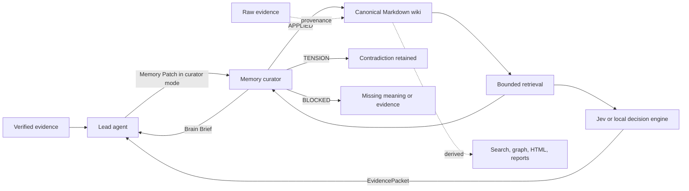

# Graphmory

[](https://github.com/Grunte12/graphmory/actions/workflows/ci.yml)
[](LICENSE)

An evidence-informed memory layer for coding agents.

Status: experimental pre-1.0. The contracts and evals are usable, but live-model benchmark results are not published yet.

Graphmory separates two responsibilities:

- The lead agent decides what a completed task means and authors a structured Memory Patch.
- The configured workflow retrieves and checks evidence. A subscription curator can maintain notes; hosted Jev or a local decision engine can judge evidence directly for the lead agent.

The lead agent keeps ownership of meaning. Decision-engine modes do not require a curator sub-agent for retrieval.

## Why This Exists

Long-running agents need durable memory, but saving every conversation creates noise and repeatedly rewriting summaries can corrupt useful evidence. This harness uses four controls:

1. **Significance gate**: save only knowledge that can change future work.
2. **Semantic ownership**: the agent with the full task context authors the memory claim.
3. **Bounded decision role**: a curator or decision engine judges evidence within its capability.
4. **Bounded recall**: future tasks receive a compact Brain Brief or EvidencePacket with exact note paths.

## Architecture



Raw evidence is the immutable evidentiary source of truth. Markdown is canonical operational memory: an agent-maintained synthesis that must remain traceable to evidence. Search indexes, knowledge graphs, and generated reports are rebuildable derived views. In Jev/local mode, durable patch placement remains lead-owned; automatic note placement is still planned.

## Quick Start

Requirements: Node.js 20 or newer.

If you are an AI coding agent installing this for a user, read [AGENTS.md](AGENTS.md) first.

```powershell
git clone https://github.com/Grunte12/graphmory.git
cd graphmory
npm test
node scripts/install.mjs --target "$HOME/.config/opencode"
```

The installer copies the `memory-curator` skill, the `src/` modules, and the CLI to the target directory. It does not overwrite `opencode.json` or agent prompts. Review the generated instructions, then apply the files under `adapters/opencode/`.

After installation, add the target's `bin/` directory to your `PATH` to run `graphmory.mjs` from anywhere. Try `node <target>/bin/graphmory.mjs doctor --json` to verify the CLI works.

The package name, GitHub repository, and primary CLI command are `graphmory`. Existing `memory-patch-harness` and `mph` commands remain as compatibility aliases. Existing vault metadata under `.memory-patch-harness/` remains readable without migration.

Initialize a project memory area:

```powershell
node scripts/init-project.mjs `
  --vault "C:\path\to\your\ObsidianVault" `
  --project "my-project"
```

Validate a patch:

```powershell
node scripts/validate.mjs examples/memory-patch.json
node scripts/validate.mjs examples/derived-index.json
node scripts/validate.mjs examples/hot-context-pack.json
node scripts/validate.mjs examples/learning-packet.json
node scripts/render-hot-context.mjs --pack examples/hot-context-pack.json --out tmp/hot-context.md
```

Run the retrieval and memory benchmarks:

```powershell
npm run eval
npm run release:gate
node scripts/eval-retrieval.mjs --dataset eval/fixtures --k 3 --json tmp/report.json
node scripts/eval-curator.mjs --candidate eval/curator/candidate.memory-patch.json
npm run eval:curator:compare
npm run eval:lifecycle
npm run eval:conflict
npm run eval:learning-loop
npm run eval:future-task
npm run eval:report
node scripts/eval-agent-run.mjs --curator-output eval/curator/candidates/C-memory-patch.json --patches eval/patch-quality/candidates
```

The retrieval benchmark compares dependency-free lexical and BM25 baselines using Hit@k, Recall@k, MRR, nDCG, and retrieved context size. The curator benchmark checks Brain Brief and Memory Patch behavior: bounded recall, provenance retention, conflict surfacing, noise rejection, and derived-artifact boundaries. The lifecycle and conflict evals test stale-memory detection and shared-brain sync decisions separately from retrieval. The comparison script scores proxy baselines for direct writing, curator inference, and Memory Patch handoff. The learning-loop eval adds token/cost proxies and a future-task utility check. `npm run eval:report` writes a generated summary to `tmp/eval-report.md`; `npm run release:gate` runs the full local release gate plus npm pack dry-run. These are evaluation surfaces, not production retrievers.

Optional portable memory sync:

```powershell
node scripts/brain-sync.mjs bootstrap `
  --vault "C:\path\to\your\BrainVault" `
  --repo "your-github-user/your-brain" `
  --create-remote

node scripts/brain-sync.mjs pull --vault "C:\path\to\your\BrainVault"
node scripts/brain-sync.mjs status --vault "C:\path\to\your\BrainVault"
node scripts/brain-sync.mjs health --vault "C:\path\to\your\BrainVault" --json
node scripts/brain-sync.mjs lifecycle-audit --vault "C:\path\to\your\BrainVault" --json
node scripts/brain-sync.mjs recall --vault "C:\path\to\your\BrainVault" --query "what did we decide about sync?" --scope "02 Projects/example" --json
node scripts/brain-sync.mjs recall-loop --vault "C:\path\to\your\BrainVault" --query "what did we decide about sync?" --scope "02 Projects/example" --json
node scripts/brain-sync.mjs curation-recommend --report tmp/private-vault-report.json --queries tmp/private-vault-gold.json --method governed-bm25f-sections --json
node scripts/brain-sync.mjs sync-plan --vault "C:\path\to\your\BrainVault" --patches 3 --json
node scripts/brain-sync.mjs push --vault "C:\path\to\your\BrainVault" --message "memory: update lessons"
```

Portable Brain Sync stores curated memory in a separate private GitHub repo so agents can continue across accounts and machines. The brain repo contains memory only; this harness repo remains the tool. Sync is autonomy-first but gate-governed: agents should keep running through reversible detect-act-verify-repair loops, while setup, adoption, restructure, conflict resolution, visibility, and meaning-changing lifecycle choices require user approval.

`recall` performs bounded lifecycle-aware retrieval with dependency-free, field-weighted BM25 section ranking by default: path, title, frontmatter, headings, and body remain separate signals, while raw inbox paths and stale/superseded notes stay out. Optional `--scope` keeps search inside a known project/domain, and low-confidence results tell the lead agent to reformulate or follow MOC/backlink context. `recall-loop` is a diagnostic fallback that fuses field-weighted and ordinary section BM25; keep `recall` as the normal low-token path unless measured misses require comparison. `sync-plan` turns batching policy into a read-only decision report; it never pushes automatically.

If a frozen eval shows repeated paraphrase misses after curation, enable the optional semantic lane:

```powershell
npm install @huggingface/transformers
node scripts/brain-sync.mjs recall-semantic --vault "C:\path\to\your\BrainVault" --query "what did we decide about sync?" --scope "02 Projects/example" --json
```

`recall-semantic` uses a local Transformers.js embedding model and fuses semantic results with BM25F. It is an escalation path, not the default: first-run model download and indexing cost are higher, and Markdown remains the canonical memory truth.

When a frozen retrieval eval misses, generate a bounded curation plan instead of manually rereading the vault:

```powershell
node scripts/brain-sync.mjs curation-recommend --report tmp/private-vault-report.json --queries tmp/private-vault-gold.json --method governed-bm25f-sections --json > tmp/curation-recommendations.json
```

The recommender classifies misses such as buried gold, missing scope, no candidates, and vocabulary/gold ambiguity, then suggests aliases/frontmatter, scope fixes, MOC links, and human-reviewed grouped-gold candidates. Agents may apply small reversible metadata/link fixes when the evidence is explicit. They should ask before grouped-gold changes, note moves, deletion, conflict resolution, or any rewrite that changes meaning.

For Hermes, OpenCode, or other agents sharing one brain, use separate local clones and run event-driven `auto-pull` at session start/before shared recall. Sync is fast-forward-only; push never auto-rebases competing memory.

Do not push every remembered item. Push at healthy thresholds: session end, account/machine handoff, 3-7 small verified patches, one high-value/risky patch, or before restructure/conflict work. Keep raw inbox noise and unresolved facts local until curated.

Run `health` after conflict resolution, restructure, large intake triage, and before publishing durable memory. It gives agents a deterministic health report instead of making them manually rediscover unresolved links, duplicate titles, missing provenance, stale notes, inbox backlog, and secret-like values.

Run `lifecycle-audit` when memory may have changed over time: after a vendor/API/policy change, before relying on old operational notes, before conflict resolution, or during periodic brain hygiene. It flags expired `valid_until`, due `revalidate_when`, active notes that contain stale language, superseded notes without replacement markers, and tension notes without decision paths. It is read-only: it creates a review/action plan, not automatic rewrites.

If sync reports `diverged` or `REMOTE_CHANGED`, run read-only conflict assistance instead of merging blindly:

```bash
node scripts/brain-sync.mjs conflict-assist --vault "C:\path\to\your\BrainVault" --json
```

The command explains local-vs-remote memory changes, highlights same-note semantic conflicts, and returns structured `decisionOptions` such as `merge-compatible`, `prefer-local`, `prefer-remote`, `supersede-local`, `supersede-remote`, `create-tension`, and `blocked-needs-evidence`. Resolution still needs a human-approved lifecycle decision before any merge or rewrite.

Existing Obsidian/custom memory is never restructured silently. The reviewed flow is `detect -> adoption-plan -> restructure-plan -> user approval -> dry-run -> apply -> verify`, with a clean-Git gate, local backup branch, exact migration record, and rollback support.

## Guides

- [Installation](docs/guides/install.md): install the skill and adapt it to OpenCode or any other coding agent.
- [Codex, Cursor, and Claude Code](docs/guides/agent-hosts.md): set up the CLI and skill for each host.
- [Portable Brain Sync](docs/guides/portable-brain-sync.md): connect a private GitHub-backed memory repo for account and machine portability.
- [Troubleshooting](docs/guides/troubleshooting.md): machine diagnostics, stable error codes, platform notes, and safe agent recovery.
- [Demo Workflow](docs/guides/demo-workflow.md): see one realistic task become a Memory Patch, Brain Brief, and Hot Context Pack.
- [Live Model Evaluation](docs/evaluation/live-model-eval.md): compare real model outputs against the deterministic evaluator.
- [Live Model Results](docs/evaluation/live-model-results.md): publish real model results separately from proxy fixtures.
- [Evaluation](docs/evaluation/evaluation.md): understand the retrieval, curator, patch-quality, and baseline comparison checks.
- [Improvement Research](docs/research/improvement-research.md): research-backed roadmap for stale-memory audits, conflict decisions, curation-first retrieval, optional reranking, live-agent evals, and resume artifacts.
- [Learning Loop](docs/design/learning-loop.md): v0.3 contract for verified behavior-changing lessons.
- [Jev-assisted retrieval plan](docs/design/jev-retrieval-plan.md): staged local retrieval optimization and an optional decision-model experiment.
- [Managed retrieval](docs/guides/managed-retrieval.md): console configuration for curator, hosted Jev, and a local System One-compatible decision endpoint.
- [Four workflow model plan](docs/research/four-workflow-models-2026-09-23.md): subscription curator, hosted Jev, local decision, and a proposed ultra-light local ranker.
- [Thai Strategy Guide](docs/guides/thai-strategy-guide.md): strategy, process, use cases, trade-offs, and limitations for Thai readers.
- [Repository Patterns](docs/design/repository-patterns.md): how this repo borrows packaging patterns from agent-tool projects without adding heavy dependencies.

## Project Health

- License: [MIT](LICENSE)
- Changelog: [CHANGELOG.md](CHANGELOG.md)
- Privacy policy: [PRIVACY.md](PRIVACY.md)
- Security policy: [SECURITY.md](SECURITY.md)
- Support policy: [SUPPORT.md](SUPPORT.md)
- Contributing guide: [CONTRIBUTING.md](CONTRIBUTING.md)
- Citation metadata: [CITATION.cff](CITATION.cff)

## Memory Patch

```json
{
  "claim": "Visual verification belongs to the agent that owns visible UI.",
  "why_it_matters": "Future routing should not send UI correctness checks to backend agents.",
  "scope": {
    "applies": ["visible UI implementation and review"],
    "excludes": ["API, data, and build verification"]
  },
  "provenance": [
    {
      "kind": "file",
      "value": "AGENTS.md"
    }
  ],
  "confidence": "high",
  "suggested_type": "decision",
  "lifecycle": {
    "status": "active",
    "revalidate_when": ["ownership policy changes"],
    "supersedes": []
  }
}
```

The curator returns one status:

- `APPLIED`: memory was merged or created with provenance.
- `TENSION`: an active note disagrees; both positions remain visible.
- `BLOCKED`: the patch lacks sufficient meaning, scope, or evidence.

## Derived Index

A derived index is an optional source map generated from files, notes, or code. It can help retrieval, but it is never canonical memory.

```json
{
  "role": "derived-index",
  "canonical_memory": false,
  "generator": {
    "name": "example-local-indexer"
  },
  "derived_from": [
    {
      "kind": "file",
      "value": "notes/00 Project Home.md"
    }
  ],
  "entries": [
    {
      "id": "note:visual-verification",
      "kind": "note",
      "label": "Visual verification policy note",
      "confidence": "high",
      "evidence_refs": [
        {
          "kind": "file",
          "value": "notes/visual-verification.md"
        }
      ]
    }
  ]
}
```

The contract is deliberately tool-agnostic. A graph, search index, source map, or generated report can implement it without becoming a dependency of this harness. Durable memory still changes only through a Memory Patch.

## Hot Context Pack

A Hot Context Pack is a compact derived prompt-prefix candidate for stable, frequently used memory. It is useful for provider prompt caching and repeated agent sessions, but it is not canonical memory.

```powershell
node scripts/render-hot-context.mjs --pack examples/hot-context-pack.json
```

Only high-utility active memory should enter this pack: current policies, preferences, routing rules, gotchas, stale warnings, and open questions. Each entry must point back to canonical notes and include lifecycle metadata so the pack can be regenerated or invalidated.

## Brain Brief

A Brain Brief contains:

- 1-7 relevant memory items
- constraints that affect the next handoff
- stale or contradictory notes to watch
- 0-3 exact note paths for optional direct reading

The lead agent should not browse the whole vault. It asks the curator to retrieve the smallest useful set.

## Repository Map

```text
adapters/opencode/       OpenCode integration examples
docs/                    Architecture, research, and evaluation
examples/                Valid example contracts
schemas/                 Machine-readable JSON Schema
scripts/                 Install, initialize, and validate
skills/memory-curator/   Installable on-demand agent skill
src/                     Dependency-free validation logic
test/                    Deterministic contract tests
```

## What Is Original Here

This repository is an original integration, not a claim to have invented agent memory or LLM wikis. Its distinct contribution is the contract between:

- lead-agent semantic authorship,
- curator-limited write authority,
- explicit `APPLIED/TENSION/BLOCKED` outcomes,
- provenance-preserving patches,
- lifecycle and stale-revalidation metadata,
- bounded Brain Brief retrieval,
- optional Derived Index and Hot Context Pack contracts,
- and deterministic contract audits.

See [Research Foundations](docs/research/research-foundations.md) for source-backed design rationale, including Agentic RAG, CAG, caching, prompt reuse, and long-term memory papers. See [Evaluation](docs/evaluation/evaluation.md) for retrieval and curator behavior checks.

See [Repository Patterns](docs/design/repository-patterns.md) for why optional graph, compression, MCP, and HTML layers are kept outside the core contracts.

## Is This Agentic RAG?

Not yet in the conventional engineering sense.

The current harness provides **agent-controlled memory retrieval**: a curator or lead agent asks scoped questions, receives bounded Markdown note paths, and turns them into a Brain Brief. The default path is dependency-free lexical/BM25F section retrieval with lifecycle filtering, scoped recall, diagnostic sparse-lane fusion, and curation recommendations. An optional local semantic hybrid lane is available when measured paraphrase misses justify embeddings, but it is not part of the core install and does not make generated indexes canonical memory.

The most accurate description is:

> **Agentic memory retrieval with an evidence-grounded compiled wiki, designed to become RAG-enabled when scale and measured retrieval failures justify it.**

Read the bilingual guide: [Where This Fits in the RAG Landscape](docs/research/rag-positioning.md).

The retrieval baseline is documented in [Evaluation](docs/evaluation/evaluation.md). Synthetic stress tests support governed BM25F section retrieval as the default local recall path. Earlier private real-vault evals exposed semantic/alias and vault-curation gaps that should be re-evaluated with the latest governed BM25F section retrieval and `curation-recommend` tooling before making public claims about private-vault effectiveness.

See [Cost and Scale](docs/evaluation/cost-and-scale.md) for private real-vault results, honest vector-RAG trade-offs, and the current scalability boundary.

See [Research Source Map](docs/research/research-source-map.md) for adopted evidence, discovery-only sources, and sources excluded as irrelevant.

See [Independent NotebookLM Review](docs/research/notebooklm-review.md) for the neutral research pass, seeded critique, accepted changes, and rejected overreach.

## License

MIT. Research papers and referenced projects remain under their own terms. See [THIRD_PARTY_NOTICES.md](THIRD_PARTY_NOTICES.md).
