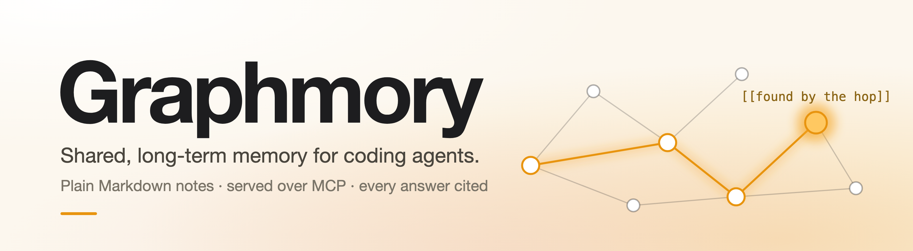

<h1 align="center"></h1>

<p align="center">
  <a href="https://github.com/Grunte12/graphmory/actions/workflows/ci.yml"></a>
  <a href="LICENSE"></a>
</p>

Graphmory is governed memory for AI agents: a local MCP server over plain Markdown notes that you own. Agents search them by keyword, meaning and `[[links]]`, every answer points back to its source, and new memories are checked before they are saved.

Status: experimental, pre-1.0. The contracts, tests and deterministic evals are in place. Only a single-model live pilot is published; there is no cross-model benchmark yet.

## Watch the film

https://github.com/user-attachments/assets/c605a1c2-2d6d-46fd-9137-213957000b69

## Why Graphmory

Memory that saves everything fills up with noise, stale facts and guesses. Graphmory keeps a small set of curated notes that any agent can search, and makes every answer prove itself.

- **Cited recall.** Answers come back with the note path and a hash of the note, so each claim can be checked against the original.
- **Honest when nothing matches.** If no note supports an answer, the result is "No supporting note", not a guess.
- **Guarded writes.** A new memory needs evidence. It is checked before it is saved, and the save returns a receipt hash. Conflicts and low-confidence memories are never written silently.
- **Memory that ages.** Notes carry a status, an expiry and revalidation triggers. Stale or replaced notes are not recalled; replaced notes stay as history. When a source changes, summaries built on it are flagged for a recheck.
- **Plain files.** Notes are Markdown in a folder or Obsidian vault, with optional private Git sync. No database and no vector server.
- **Any MCP client.** Three tools, one server: Claude Code, Codex, Cursor, Gemini CLI, GitHub Copilot, OpenCode, Cline, Zed and others.

## How it works

![System architecture. You give your coding agent a task. In your agent host, the coding agent asks the Curator, which returns a cited brief. The coding agent calls remember and the Curator calls recall and read on the Graphmory MCP server, and every call returns an answer. The engine behind the tools runs keyword, meaning and link search, guarded writes and lifecycle filtering. It reads and writes your Obsidian-compatible Markdown vault, keeps checkpoints and a review queue in private state outside the vault, and can sync the vault through Git. You approve low-confidence memories in a terminal.](docs/assets/graphmory-architecture.png)

Three roles share the work:

| Role | Does |
|---|---|
| **Lead agent** | Your main coding agent. Decides what a finished task means, what is worth remembering, and whether a change is allowed |
| **Curator** | A small, cheap model in your agent host. Reads the original notes, verifies the evidence and returns a short cited brief |
| **Graphmory** | Finds candidate notes and guards every write. Runs on your machine and never invents or rewrites meaning |

![Inside the engine. Recall: a question is filtered to active notes, then keyword and meaning search run in parallel and the links lane follows authored links up to 3 hops from their top hits. The lanes are fused with RRF into ranked notes, or "No supporting note" when there are no candidates. Remember: a proposal passes evidence and permission, overlap and confidence checks, then a new note is written with a receipt hash and the result is APPLIED. An overlap gives TENSION; a failed check gives BLOCKED, and low confidence waits in a private review queue for the owner.](docs/assets/graphmory-engine.png)

Search combines three lanes: keyword matching (BM25F over note sections), meaning (a local BGE embedding model) and the `[[links]]` you author between notes, followed up to 3 hops. The lanes are merged with Reciprocal Rank Fusion into one ranking. Details: [MCP recall](docs/guides/mcp-recall.md).

## Quick start

1. **Install the CLI** (not on npm yet, so install from this repository; Node.js 20+ and Git are required):

   ```sh
   git clone https://github.com/Grunte12/graphmory.git
   cd graphmory
   npm install -g .
   ```

2. **Set it up.** Ask your coding agent: *"Install Graphmory from this checkout using `adapters/generic-agent/INSTALL.md`."* It asks where your vault lives, whether to sync through Git, and which small model the Curator should use. Manual commands for Codex, Claude Code and Cursor are in [host setup](docs/guides/agent-hosts.md).
3. **Check it:**

   ```sh
   graphmory doctor
   ```

   Expect `vault ok`, `curator model ok (<model>)`, `mcp tools: recall · read · remember` and `meaning search ok`. Any line that says `needs attention` comes with the fix.
4. **Connect your agent** to the MCP server, below.

Optional: `graphmory semantic-warmup` downloads the local meaning model once (about 130 MB) so the first recall does not wait.

## Connect your agent

`graphmory-mcp` is a standard stdio MCP server. Point it at your vault with `GRAPHMORY_VAULT`.

Claude Code (`.mcp.json`) and Cursor (`.cursor/mcp.json`):

```json
{"mcpServers":{"graphmory":{"command":"graphmory-mcp","env":{"GRAPHMORY_VAULT":"/path/to/vault"}}}}
```

Codex (`config.toml`):

```toml
[mcp_servers.graphmory]
command = "graphmory-mcp"
env = { GRAPHMORY_VAULT = "/path/to/vault" }
```

OpenCode (`opencode.json`):

```json
{"mcp":{"graphmory":{"type":"local","command":["graphmory-mcp"],"environment":{"GRAPHMORY_VAULT":"/path/to/vault"}}}}
```

Other hosts: [MCP host configuration](docs/guides/mcp-hosts.md). For a client that cannot start a local process, [Streamable HTTP](docs/guides/mcp-http.md) is available behind a bearer token.

## The three tools

| Tool | What it does |
|---|---|
| `recall` | Finds a ranked shortlist for a question: up to ten candidates per page, each with path, heading, excerpt, note hash and the search lanes that found it. Pages with a cursor; a query is limited to 8 pages |
| `read` | Opens the original note, or one section of it, so the Curator can verify a candidate. A stale hash is refused |
| `remember` | Saves a decision with its evidence. Returns `APPLIED`, `TENSION` or `BLOCKED` |

What `remember` returns:

| Outcome | Meaning |
|---|---|
| `APPLIED` | Saved as a new note, with a receipt hash for what was written. A replaced note stays as history |
| `TENSION` | An active note overlaps or conflicts. Nothing is written until the agent has read it and answered |
| `BLOCKED` | Evidence is missing or stale, a secret was found, or confidence is low. Nothing is written. Low-confidence memory waits in a private queue for you: `graphmory review list`, then `approve` or `reject` |

The agent cannot approve its own low-confidence memory; there is no MCP tool for it. Guides: [recall and citation](docs/guides/mcp-recall.md), [guarded writes](docs/guides/mcp-remember.md), [memory contracts](docs/guides/memory-contracts.md).

## Documentation

| Topic | Read |
|---|---|
| Install and hosts | [Installation](docs/guides/install.md) · [Codex, Cursor and Claude Code](docs/guides/agent-hosts.md) · [MCP hosts](docs/guides/mcp-hosts.md) · [Vault layout](docs/guides/vault-setup.md) · [Troubleshooting](docs/guides/troubleshooting.md) |
| Using it | [CLI reference](docs/guides/cli-reference.md) · [Portable Brain Sync](docs/guides/portable-brain-sync.md) · [Demo workflow](docs/guides/demo-workflow.md) · [Managed retrieval](docs/guides/managed-retrieval.md) |
| Design | [Memory contracts](docs/guides/memory-contracts.md) · [Learning loop](docs/design/learning-loop.md) · [Positioning and RAG](docs/research/positioning.md) · [Research foundations](docs/research/research-foundations.md) |
| Evaluation | [Evaluation](docs/evaluation/evaluation.md) · [Cost and scale](docs/evaluation/cost-and-scale.md) · [Live model results](docs/evaluation/live-model-results.md) · `npm run eval` |

## Project

[MIT license](LICENSE) · [Changelog](CHANGELOG.md) · [Privacy](PRIVACY.md) · [Security](SECURITY.md) · [Support](SUPPORT.md) · [Contributing](CONTRIBUTING.md) · [Citation](CITATION.cff) · [Third-party notices](THIRD_PARTY_NOTICES.md)

Graphmory was previously called memory patch harness. Per-vault sync metadata is still stored under `.memory-patch-harness/`.
